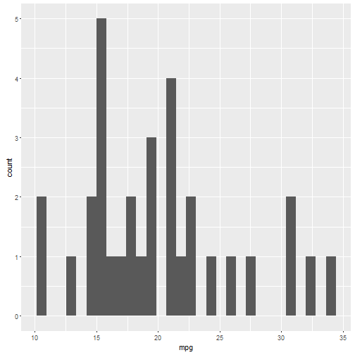
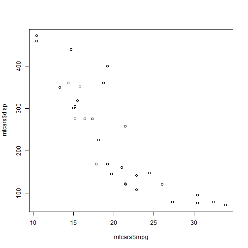

```r
library(shiny)
```

```
## Warning: package 'shiny' was built under R version 3.2.5
```

```r
library(ggplot2)
library(plotly)
```

```
## Warning: package 'plotly' was built under R version 3.2.5
```

```
## 
## Attaching package: 'plotly'
```

```
## The following object is masked from 'package:ggplot2':
## 
##     last_plot
```

```
## The following object is masked from 'package:graphics':
## 
##     layout
```


##1. Introduction
This is a shiny presentation using "mtcars database. There are three tab panels: the first one creates a histogram from a chosen variable; the second one combines two variables producing a two dimension graphic; the third one provides a statistical summary.

##2. Shiny App
###2.1 Histograms
To create an histogram I've used ggplot and plotly. The user can choose any variable from database. Let's see an example with the plotly library


```r
a<-qplot(mpg, data=mtcars)
a
```

```
## `stat_bin()` using `bins = 30`. Pick better value with `binwidth`.
```



###2.2 Two variable scatterplot
In this tab panel the user can choose two variables from mtcars dataset. Automatically, there is a scatterplot of these two variables.


```r
plot(mtcars$mpg, mtcars$disp)
```




###2.2 Statistical summary
In this tab panel the user can select from a checkbox the variables he/she wants to incorporate to the summary.


```r
summary(mtcars$mpg)
```

```
##    Min. 1st Qu.  Median    Mean 3rd Qu.    Max. 
##   10.40   15.42   19.20   20.09   22.80   33.90
```


##3 Conclusion
The advantage of shiny application is its interactivity, and the user easily can choose different graphics and variables.
